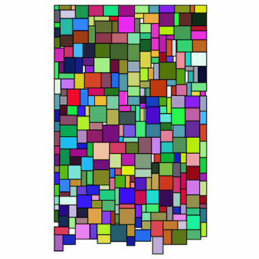
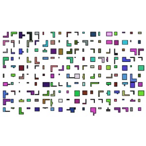
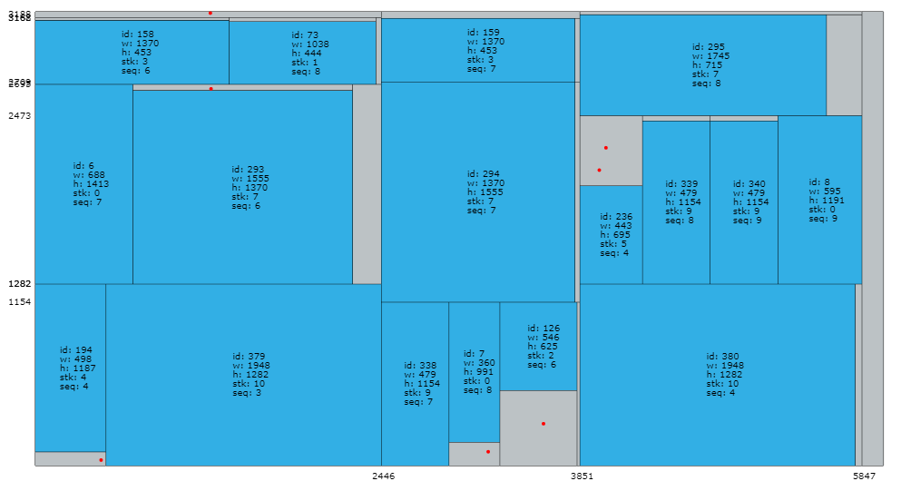

### Hi there, I'm Yan! 👋


- 🔭 I’m currently studying Computer Science at [HUST](https://www.hust.edu.cn/).
- 🌱 I’m currently majoring in **Combinatorial Optimization** at the 3rd year of my postgraduate study.
- 😄 I’m interested in  programming, and sometimes write small scripts in .
- 📫 How to reach me: [](https://lyandut.github.io)  [](https://www.zhihu.com/people/li-yan-44-55-45) [](https://weibo.com/5657204877).


### Maybe you'll be interested in...

| [SmartFloorplan](https://github.com/lyandut/SmartFloorplan)  |      [SmartMPW](https://github.com/lyandut/SmartMPW)       |  [GuillotineCut](https://github.com/zjl9959/GuillotineCut)   |
| :----------------------------------------------------------: | :--------------------------------------------------------: | :----------------------------------------------------------: |
|  |  |  |


### Yan Li's Waka Time

<!--START_SECTION:waka-->

```txt
From: 07 October 2025 - To: 14 October 2025

Go         8 hrs 27 mins   ████████████████████████░   95.80 %
Markdown   8 mins          ▒░░░░░░░░░░░░░░░░░░░░░░░░   01.62 %
go.mod     6 mins          ▒░░░░░░░░░░░░░░░░░░░░░░░░   01.30 %
YAML       5 mins          ▒░░░░░░░░░░░░░░░░░░░░░░░░   01.00 %
Text       1 min           ░░░░░░░░░░░░░░░░░░░░░░░░░   00.27 %
```

<!--END_SECTION:waka-->


[](https://github.com/anuraghazra/github-readme-stats)


⭐️ From [lyandut](https://github.com/lyandut).
